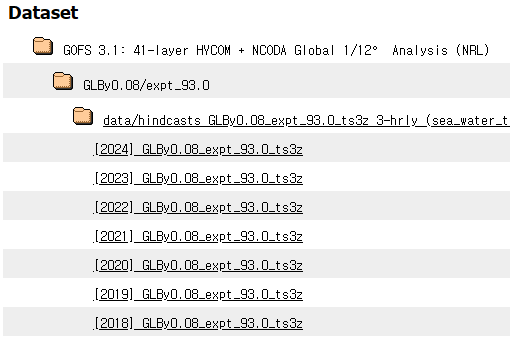
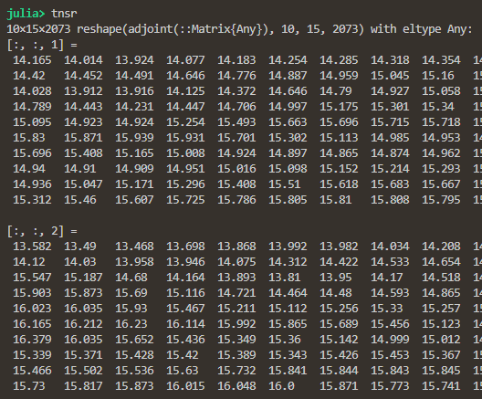

# SeaSurfaceTemperature
It's data analysis repository for East Sea surface temperature prediction project.

## Data Description

### Source

- [HYCOM Data Server](https://tds.hycom.org/thredds/catalogs/GLBy0.08/expt_93.0_ts3z.html): HYCOM (HYbrid Coordinate Ocean Model) provides the sea surface temperature data used in this project.
    - We specifically chose the GLBy0.08, experiment 93.0 dataset.
    - The data $\left\\{ Y_{t} \right\\}_{t=1}^{2073}$ spans `2019-01-01` to `2024-09-04`, with a single data point at 12:00:00 each day.
    - $Y\_{t} \in \mathbb{R}^{10 \times 15}$ represents the sea surface temperature, longitude($i \equiv x$) range 129.52°E to 130.24°E, latitude($j \equiv y$) range 36.32°N to 36.88°N. $\Delta x = 0.08^{\circ}, \Delta y = 0.08^{\circ}$ (see `data/lon.csv` and `data/lat.csv`).

### Preprocessing

 - For `$y = 2019, ... , 2024`, each `data/data_$y.nc4` is an annual raw NetCDF4 file containing daily sea surface temperature data.
 - `data/data_GLBy0.08_expt_93.0.csv` is a preprocessed CSV file where each row corresponds to a flattened version of the daily sea surface temperature matrix $Y_{t}$. One can reshape each row back to the original $10 \times 15$ matrix for analysis, for instance, `reshape(Yt, 10, 15)`.
   - `data/data_tnsr.jld2` is a JLD2 file storing the same data tensor for efficient loading in Julia.
 - Index `t` is mapped to `2019-01-01` as `t=1`, `2019-01-02` as `t=2`, ..., up to `2024-09-04` as `t=2073`.
 - Index `i` (longitude) is mapped from `129.52°E` as `i=1`, `129.60°E` as `i=2`, ..., to `130.24°E` as `i=10`.
 - Index `j` (latitude) is mapped from `36.32°N` as `j=1`, `36.40°N` as `j=2`, ..., to `36.88°N` as `j=15`.
